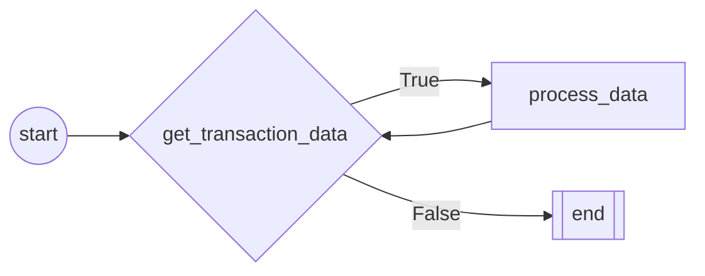

#Robot

    Robot class:
    ----------------
    Robot class - Inherits from Bot class.
    This Framework is design to test the Robot Funcionality
    

# FLOW CHART

# FLOW NODES
## NODE: start
 
        start method
        ======================
        Start method is the first method to be executed.
        Use this method to execute the robot's initialization.
        Example usage:
            1. Initialize the robot's variables.
            2. Clean up the environment.
            3. Get the robot's data.
            4. Open Applications
        
## NODE: get_transaction_data
 
        Get transaction data method
        ===========================
        Get transaction data method is the method that gets the data from the source.
        Use this method to get each transactional item and send it to the next method to be processed.
        Example usage:
            1. Get the data from the source.
            2. Send the data to the next method.
        
## NODE: process_data
 
        Process data Method
        ======================
        Process data method is the method that processes the data gathered from the previous method.
        Use this method to process the data.
        Arguments:
            1. *args: Receives data from the previous method.
        Example usage:
            1. Process the data.
        
## NODE: end
 
        End method
        ======================
        End method is the last method to be executed.
        Use this method to execute the robot's finalization.
        Example usage:
            1. Close the applications.
            2. Clean up the environment.
        