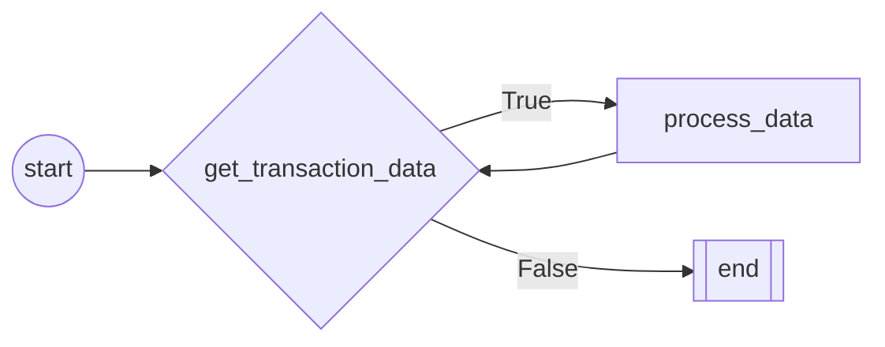

# Robot Framework - RPA Developement Framework in Pure Python

<p align="center">
  
</p>


The Robot Framework stands out as a premier open source RPA (Robotic Process Automation) software, expertly crafted in Python for streamlined 
and efficient automation development. As a powerful RPA Python tool, it is uniquely positioned for rapid, user-friendly creation of automation scripts.
With the Robot Framework, you unlock the potential to seamlessly integrate your automations with the robot manager console, leveraging
advanced cloud capabilities or opting for local execution.
This open source RPA software empowers developers to harness the full power of RPA Python, ensuring a versatile and scalable approach to automation.
Whether your goal is to automate complex business processes or streamline mundane tasks, the Robot Framework offers a robust, flexible solution, making
it a top choice for developers seeking efficiency and effectiveness in their RPA endeavors."

# Integration with Robot Manager Console:
The Bot Class, which is a structured template or a collection of methods and properties for bots, can utilize native methods
to communicate and integrate with the robot manager console. 
This integration is crucial for the seamless operation, management, and monitoring of RPA activities.
<p align="center">
  
</p>


Assets:
Assets are typically shared variables or credentials that robots can use to perform tasks. They are essential for bots that require constant updates or access to shared resources. The Bot Class would have methods that can request and retrieve these assets from the robot manager console, allowing bots to use the latest information, like login details or configuration settings, to execute their tasks effectively.

Queues:
Queues are a way to manage and distribute work items to bots. They act as a holding area for tasks that are pending execution. The Bot Class would include methods to enqueue tasks or retrieve tasks from these queues. By integrating with the robot manager console, bots can ensure they are processing the most current and prioritized work items, allowing for efficient task management and execution tracking.

Items:
Items are individual units of work that are processed by the bots. They might contain data or instructions necessary to complete a specific task. The Bot Class would use native methods to fetch these items from the robot manager console, process them, and update their status upon completion. This allows for real-time tracking of the progress and outcomes of the tasks.

Logs:
Logs are records of events, operations, or transactions that bots perform. They are crucial for monitoring bot activity, auditing, and troubleshooting. The Bot Class can utilize methods to send log entries to the robot manager console. These logs can then be analyzed to understand bot performance, identify bottlenecks or errors, and optimize the automation processes.


## Robot Files
Find the robot files in the **robot** directory.
### 1. robot.py
**Robot class:**

This class is used to design the main structure of the robot.
It contains all the methods to be executed by the robot.
Heritages from Bot class to use predefine features and attributes.

**Example:**

```python
from robot.robot import Bot
    
class Robot(Bot):
    def __init__(self,**kwargs):
        super().__init__(**kwargs)   
    def start(self):
        print("I'm the fitst method")
    def second(self):
        print("I'm the second method")
    def last(self):
        print("I'm the last method")    
```        

**Arguments:**

Robot class can receive some arguments to establish connection with the robot manager console.
These arguments are sent automatically from the robot manager console to initialize Bot class and establish the connection. 
You can also set the variables in **debug.json** file to use some console features while debugging your code.


1. robotId: The robot's ID.
2. ExecutionId: The execution ID.
3. url: The url of the iBott API.
4. username: The username of iBott account.
5. password: The password of iBott account.
6. orchestrator_parameters: Additional parameters sent from the robot manager console.

**Decorators:**

@RobotFlow is a decorator class that creates the flow of the bot.
It grabs all decorated functions from the Robot class to create the workflow. 

Example:
```python
from robot.robot import Bot
from iBott import RobotFlow
from robot.flow import Nodes
class Robot(Bot):
    def __init__(self):
        super().__init__()   
    @RobotFlow(Nodes.StartNode)    
    def start(self):
        print("I'm the fitst method")
```

**Arguments:**
To instance Nodes classes and register them in the flow.
1. Nodes: Nodes class that contains the nodes of the flow read more in flow.py .
2. parents: *optional - Defines the ancestors of the current node in the flow.
3. condition: *optional - Defines the condition of the current node for conditional nodes.


**BusinessException & SystemException**

Default exception classes for the robot.
You must define your own process_exception method in file robot/exceptions.py if you want to use them.
1. BusinessException: Exception raised when the robot fails due to a Business error like input errors, data validation etc.
2. SystemException: Exception raised when the robot fails due to a System error like connection errors, etc.

**Arguments:**

1. Robot: Robot class
2. Message: Exception message
3. next_action: method from robot class to be executed after the exception occurs. like retry, restart, skip, etc.


### 2. flow.py

Here You can create your custom node classes for your workflow.
New node classes must heritage from the base class RobotNode and be registered in the enum class Nodes.

**Run function:**

You can also override function run for default framework nodes.

**Example:**

```python
from iBott.robot_activities.nodes import *
from enum import Enum
class CustomNode(RobotNode):
    def __init__(self,  **kwargs):
        super().__init__(**kwargs)
        
    #Override default run method    
    def run(self, robot, *args):
        print("I'm the run funtion")
        
#Register custom nodes            
class Nodes(Enum):
    CustomNode = CustomNode
```
### 3. exceptions.py
Here you can define the actions your process must do when exceptions are raised.

**SystemException:**
This class Heritages from *RobotException* and is used to handle exceptions caused by system errors.

**BusinessException:**
This class Heritages from *RobotException* and is used to handle exceptions caused by Business errors.

*RobotException* class has  3 default actions to handle the exception:
1. retry: Retry the current node.
   1. restart: Restart the current node.
   2. go_to_node: Go to a specific node.
   3. skip: Skip the current node.
   4. stop: Stop the current flow.

Example:
```python
from iBott.robot_activities.exceptions import RobotException
class SystemException(RobotException):
    
    def _init__(self, *args, **kwargs):
        super.__init__(*args, **kwargs)
    def process_exception(self):
       #send log to robot manager console.
       self.robot.Log.business_exception(self.message)
       #Process exception
       if self.next_action == "retry":
          self.retry(3)
       elif self.next_action == "restart":
          self.restart(3)
       elif self.next_action == "go_to_node":
          self.go_to_node("end",3)
       elif self.next_action == "skip":
          self.skip()
       elif self.next_action == "stop":
          self.stop()
       else:
          raise Exception("Invalid next_action")
       
       
class BusinessException(Exception):
   def __init__(self, *args, **kwargs):
        super.__init__(*args, **kwargs)
   def process_exception(self):
     self.robot.Log.business_exception(self.message)
     self.stop()
```


#Robot

    Robot class:
    ----------------
    Robot class - Inherits from Bot class.
    This Framework is design to test the Robot Funcionality
    


# FLOW CHART

# FLOW NODES
## NODE: start
 
        start method
        ======================
        Start method is the first method to be executed.
        Use this method to execute the robot's initialization.
        Example usage:
            1. Initialize the robot's variables.
            2. Clean up the environment.
            3. Get the robot's data.
            4. Open Applications
        
## NODE: get_transaction_data
 
        Get transaction data method
        ===========================
        Get transaction data method is the method that gets the data from the source.
        Use this method to get each transactional item and send it to the next method to be processed.
        Example usage:
            1. Get the data from the source.
            2. Send the data to the next method.
        
## NODE: process_data
 
        Process data Method
        ======================
        Process data method is the method that processes the data gathered from the previous method.
        Use this method to process the data.
        Arguments:
            1. *args: Receives data from the previous method.
        Example usage:
            1. Process the data.
        
## NODE: end
 
        End method
        ======================
        End method is the last method to be executed.
        Use this method to execute the robot's finalization.
        Example usage:
            1. Close the applications.
            2. Clean up the environment.


### 3.settings.py
Here you can define all the constants you are going to use during the process.

````python
import os
from pathlib import Path
"""Folders to store Chrome Driver DON'T CHANGE"""
ROBOT_FOLDER = Path(os.path.dirname(os.path.realpath(__file__))).parent
CHROMEDRIVER_PATH = os.path.join(ROBOT_FOLDER, "Driver")
"""Email General settings"""
EMAIL_ACCOUNT = None
EMAIL_PASSWORD = None
````
 
