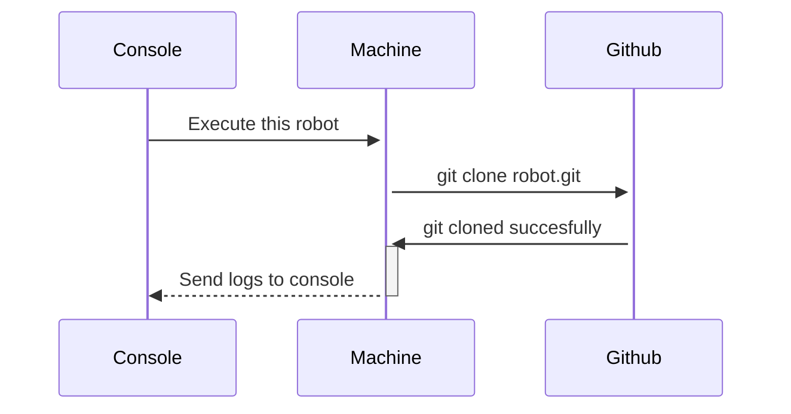
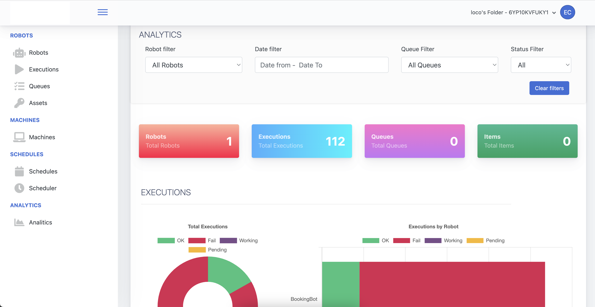
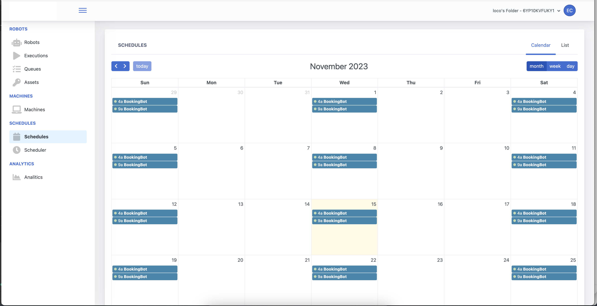
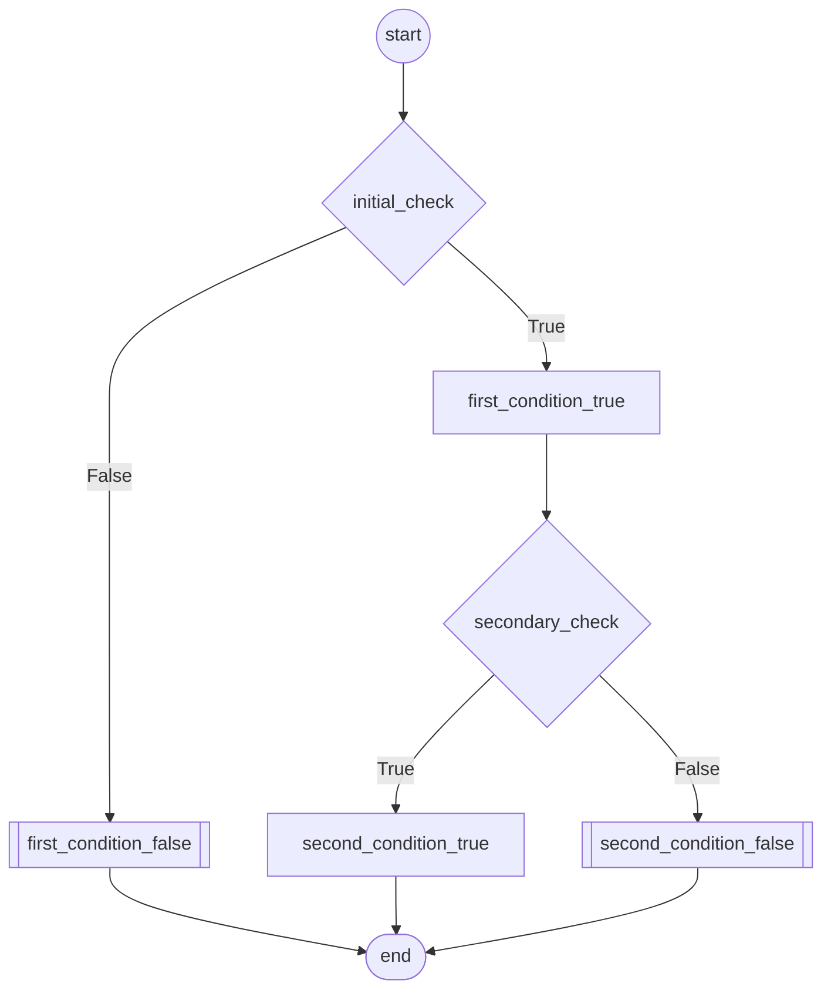
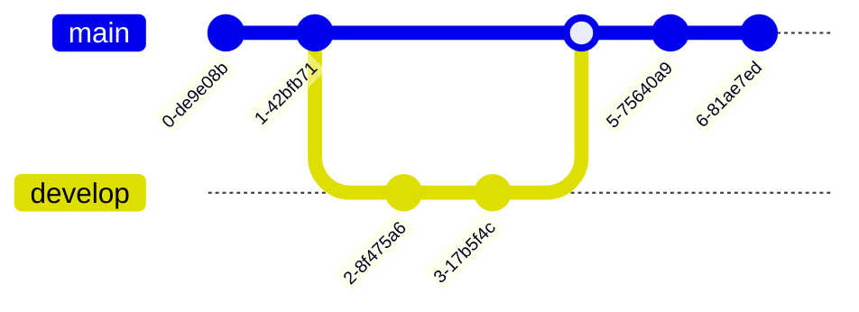

# Robot Framework - RPA Developement Framework in Pure Python

<p align="center">
  
</p>


The Robot Framework stands out as a premier open source RPA (Robotic Process Automation) software, expertly crafted in Python for streamlined 
and efficient automation development. As a powerful RPA Python tool, it is uniquely positioned for rapid, user-friendly creation of automation scripts.
With the Robot Framework, you unlock the potential to seamlessly integrate your automations with the robot manager console, leveraging
advanced cloud capabilities or opting for local execution.
This open source RPA software empowers developers to harness the full power of RPA Python, ensuring a versatile and scalable approach to automation.
Whether your goal is to automate complex business processes or streamline mundane tasks, the Robot Framework offers a robust, flexible solution, making
it a top choice for developers seeking efficiency and effectiveness in their RPA endeavors."

## What Robot Framework can do? 
### Introducing the Robot Console
The centerpiece of the Robot Framework's suite of tools, offering a comprehensive web application to manage and schedule your automations. 
The best part? It's completely free, democratizing access to advanced automation management for everyone.
The Robot Console is not just another tool; it is your command center, where every aspect of your automation tasks is at your fingertips. 
Here’s a rundown of what the Robot Console enables you to do:

### Connect to GitHub
Seamlessly connect your Robot Framework projects with GitHub repositories. This integration allows you to synchronize your codebase, 
ensuring that your automation scripts are always up-to-date with the latest changes from your development team. With just a few clicks, 
your code on GitHub can be ready to run in your automation environment.



Experience the Robot Framework in action and see firsthand how the Robot Console can revolutionize your automation workflows. You can access the tool directly using the following link: [Robot Console](https://robot-console-a73e07ff7a0d.herokuapp.com/).
This live environment provides you with a hands-on opportunity to explore its extensive features, from creating and managing robots to monitoring their executions and managing assets, queues, and schedules.

If you're interested in a more in-depth exploration or would like to customize the console, you are welcome to request permission to clone the repository. 
Visit [robot_console](https://github.com/ecrespo66/robot_console) on GitHub to access the source code. Cloning the repository gives you the flexibility to 
modify the console, allowing you to tailor it to your specific needs and gain a deeper understanding of its inner workings.


<p align="center">
  
</p>


### Detailed Logs
Gain valuable insights with detailed logs that are generated for each robot execution. 
These logs are critical for debugging and provide a transparent overview of the automation's activities and performance, 
allowing you to quickly identify and rectify any issues.

<p align="center">
  
</p>

### Assets Management:
Manage shared resources such as credentials, configuration files, or any data required by your robots. 
Assets are securely stored and can be easily accessed by robots during execution, which simplifies resource management and enhances security.
<p align="center">
  
</p>


### Queues & Items:
Organize and control the flow of work items using Queues. The Robot Console allows you to define queues where robots can pick up and process items in an 
orderly fashion, ensuring that every task is accounted for and handled according to priority.

<p align="center">
  
</p>

### Schedules
Take control of when your robots run with the scheduling feature. You can plan your automation tasks to run at specific intervals, manage one-off jobs, 
or set up complex schedules to suit the demands of your business operations.

<p align="center">
  
</p>


## Simple python design
If you're looking for a streamlined and powerful approach to designing automation robots in Python, the Robot Framework presents an ideal solution. 
This framework simplifies the process of creating complex workflows, enabling both novices and seasoned developers to build robust automation tasks with ease.

The beauty of the Robot Framework lies in its elegant design and its utilization of Python's decorator functionality to define flows. 
With a simple @RobotFlow decoration, you can transform ordinary methods into components of a sophisticated automation sequence. 




## QuickStart
Create the new repository from a template via GitHub CLI:
You can use the gh command to create a new repository from a template repository.

Replace <your-new-repo-name> with the name you want for your new repository. This command creates a new repository on GitHub based on the specified template repository.
```sh
gh repo create <your-new-repo-name> --template="ecrespo66/Robot-framework"
````

Clone your new repository to your local machine:
After the repository has been created on GitHub, you can clone it to your local machine to start working on it.

Replace your_username with your actual GitHub username and your-new-repo-name with the name of the repository you've just created.

```sh
git clone https://github.com/your_username/your-new-repo-name.git
```
Navigate into your repository directory:
Once cloned, move into your new repository's directory to begin working on it.

```sh
cd your-new-repo-name
```


## Advanced Skills
Our comprehensive [Wiki](wiki.md) is designed to equip you with a deeper understanding and advanced skills necessary for 
leveraging the full potential of our Robot Framework. Here's what you can discover:

### In-Depth Framework Customization
Learn how to tailor the Robot Framework to fit your specific automation needs. This includes customizing keywords,
creating user-defined libraries, and modifying existing ones to enhance functionality.

### Integration Techniques
Explore methods to integrate the Robot Framework with other tools and systems. 
This includes continuous integration setups, version control integrations, and connecting with various APIs.

### Best Practices for Scaling
Find strategies for scaling your automation, managing large projects, and collaborating effectively with large teams. 
This includes structuring your repository, managing large sets of test data, and maintaining high performance.

### Debugging and Problem-Solving
Delve into advanced debugging techniques to identify and resolve issues within your automation scripts. 
Learn how to use logging, breakpoints, and other diagnostic tools to troubleshoot effectively.

For more detailed information, please refer to our [Wiki](wiki.md), where you can find: