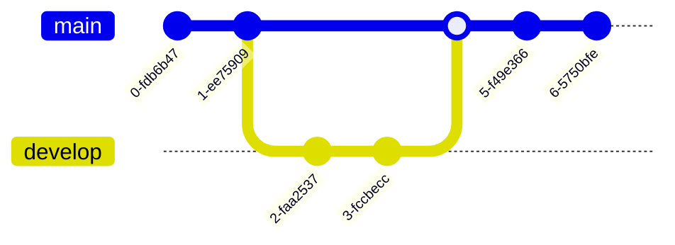
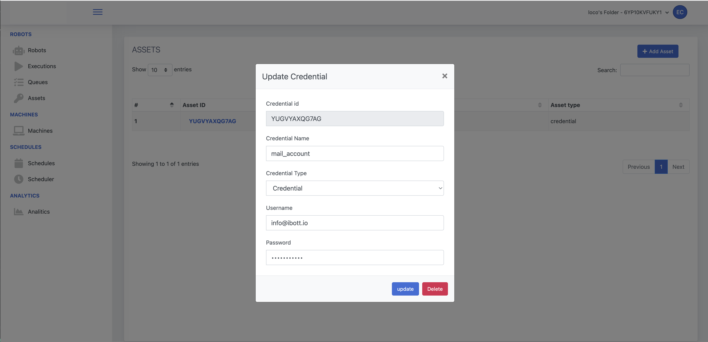
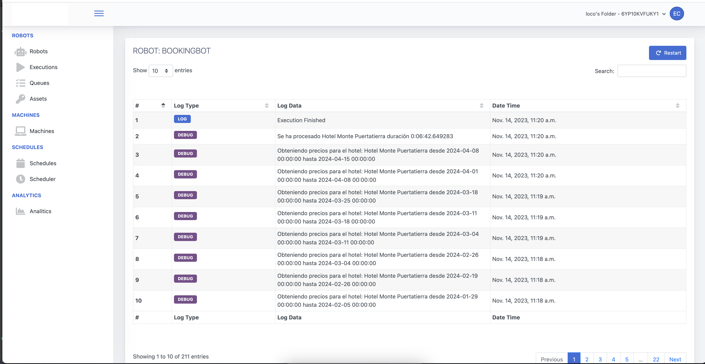

# Robot Framework - RPA Developement Framework in Pure Python




The Robot Framework stands out as a premier open source RPA (Robotic Process Automation) software, expertly crafted in Python for streamlined 
and efficient automation development. As a powerful RPA Python tool, it is uniquely positioned for rapid, user-friendly creation of automation scripts.
With the Robot Framework, you unlock the potential to seamlessly integrate your automations with the robot manager console, leveraging
advanced cloud capabilities or opting for local execution.
This open source RPA software empowers developers to harness the full power of RPA Python, ensuring a versatile and scalable approach to automation.
Whether your goal is to automate complex business processes or streamline mundane tasks, the Robot Framework offers a robust, flexible solution, making
it a top choice for developers seeking efficiency and effectiveness in their RPA endeavors."

## What Robot Framework can do? 
The Bot Class, which is a structured template or a collection of methods and properties for bots, can utilize native methods
to communicate and integrate with the  **robot manager console.**
This integration is crucial for the seamless operation, management, and monitoring of RPA activities.
<p align="center">
  
</p>

### Assets:
Assets are typically shared variables or credentials that robots can use to perform tasks. They are essential for bots that require constant updates or access to shared resources. 
The Bot Class would have methods that can request and retrieve these assets from the robot manager console, allowing bots to use the latest information,
like login details or configuration settings, to execute their tasks effectively.
<p align="center">
  
</p>


### Queues & Items:
Queues are a way to manage and distribute work items to bots. They act as a holding area for tasks that are pending execution. 
The Bot Class would include methods to enqueue tasks or retrieve tasks from these queues. By integrating with the robot manager console, 
bots can ensure they are processing the most current and prioritized work items, allowing for efficient task management and execution tracking.
Items are individual units of work that are processed by the bots. They might contain data or instructions necessary to complete a specific task. 
The Bot Class would use native methods to fetch these items from the robot manager console, process them, and update their status upon completion. 
This allows for real-time tracking of the progress and outcomes of the tasks.

<p align="center">
  
</p>

###  Logs:
Logs are records of events, operations, or transactions that bots perform. They are crucial for monitoring bot activity, auditing, and troubleshooting. 
The Bot Class can utilize methods to send log entries to the robot manager console. These logs can then be analyzed to understand bot performance, 
identify bottlenecks or errors, and optimize the automation processes.

<p align="center">
  
</p>


## QuickStart
Create the new repository from a template via GitHub CLI:
You can use the gh command to create a new repository from a template repository.

```sh
gh repo create <your-new-repo-name> --template="ecrespo66/Robot-framework"
Replace <your-new-repo-name> with the name you want for your new repository. This command creates a new repository on GitHub based on the specified template repository.
````
Clone your new repository to your local machine:
After the repository has been created on GitHub, you can clone it to your local machine to start working on it.

```sh
git clone https://github.com/your_username/your-new-repo-name.git
Replace your_username with your actual GitHub username and your-new-repo-name with the name of the repository you've just created.
```
Navigate into your repository directory:
Once cloned, move into your new repository's directory to begin working on it.

```sh
cd your-new-repo-name
```


## Advanced Skills
Our comprehensive Wiki is designed to equip you with a deeper understanding and advanced skills necessary for 
leveraging the full potential of our Robot Framework. Here's what you can discover:

### In-Depth Framework Customization
Learn how to tailor the Robot Framework to fit your specific automation needs. This includes customizing keywords,
creating user-defined libraries, and modifying existing ones to enhance functionality.

### Integration Techniques
Explore methods to integrate the Robot Framework with other tools and systems. 
This includes continuous integration setups, version control integrations, and connecting with various APIs.

### Best Practices for Scaling
Find strategies for scaling your automation, managing large projects, and collaborating effectively with large teams. 
This includes structuring your repository, managing large sets of test data, and maintaining high performance.

### Debugging and Problem-Solving
Delve into advanced debugging techniques to identify and resolve issues within your automation scripts. 
Learn how to use logging, breakpoints, and other diagnostic tools to troubleshoot effectively.

For more detailed information, please refer to our [Wiki](wiki.md), where you can find: