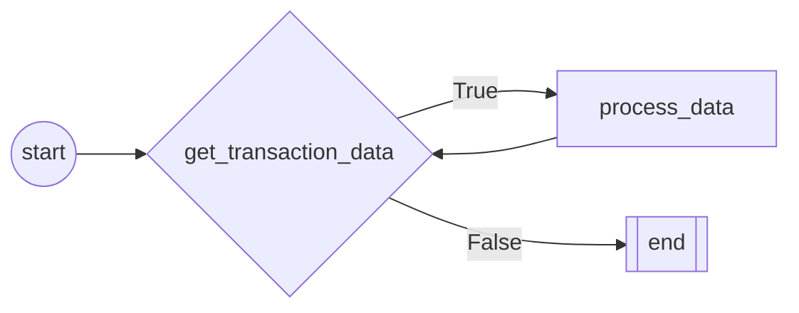

#Robot

    Robot class:
    ----------------
    Robot class - Inherits from Bot class.
    ** Describe what the robot does **

    

# FLOW CHART

# FLOW NODES
## NODE: start
 
        start method
        ======================
        Start method is the first method to be executed.
        Use this method to execute the robot's initialization.
        Example usage:
            1. Initialize the robot's variables.
            2. Clean up the environment.
            3. Get the robot's data.
            4. Open Applications
        
## NODE: get_transaction_data
 Get transaction data
## NODE: process_data
 Run robot process
## NODE: end
 Finish robot execution, cleanup environment, close applications and send reports
        