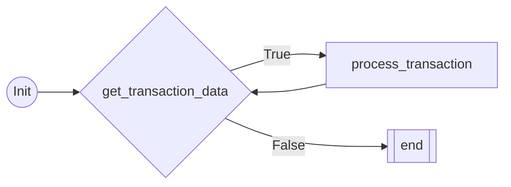
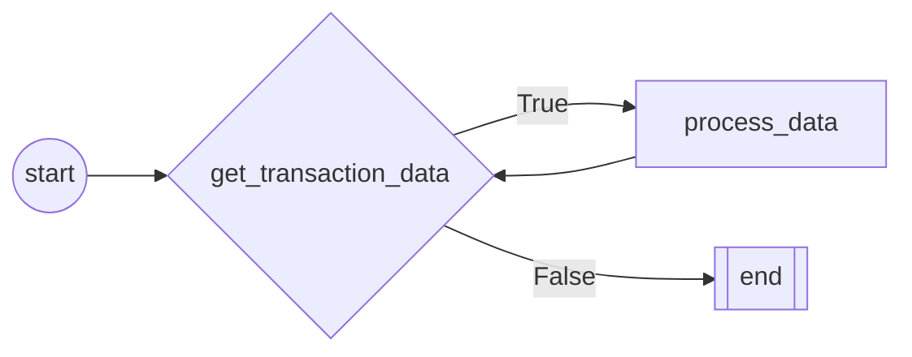

# Robot Framework Wiki

Welcome to the Robot Framework Wiki. Here, you'll find detailed information to help you understand and utilize the advanced features of our automation framework. This document will guide you through the key components and show you how to implement and customize them for your specific needs.

## Dependencies

The Robot Framework is dependent on the `ibott-robot-manager` package, which is essential for managing the automated tasks within the framework. To ensure the framework runs smoothly, you will need to install this package.

### ibott-robot-manager Installation

The `ibott-robot-manager` can be installed directly from PyPI using pip. This package is required for the Robot Framework to communicate with the robot manager console and utilize its features. To install the package, run the following command in your terminal or command prompt:

```shell
pip install ibott-robot-manager
```

This command will download and install the ibott-robot-manager along with its dependencies.

Alternatively, if you are setting up your environment based on specific requirements outlined in a requirements.txt file from the robot-manager repository, you may install the dependencies as follows:

```shell
pip install -r requirements.txt
```

## QuickStart

### Create your first robot

Within the **robot** directory, you'll find all the necessary files that define the Robot Framework's structure and behavior.
Bot Class in Robot Framework
The Bot class is a fundamental part of the Robot Framework, designed to serve as a base class for creating various types of robotic functionalities. Below is a detailed explanation of how to use the Bot class, along with a specific example.

### Overview of Bot Class
The Bot class typically encapsulates common functionalities and properties that are essential for different types of robots. It serves as a superclass from which specific robot classes can inherit.

### Using the Bot Class
To utilize the Bot class, one needs to inherit from it while creating a new robot class. This approach allows the new class to leverage the pre-defined functionalities of the Bot class, while also adding specific functionalities unique to the new robot.


```python
from robot.robot import Bot

class Robot(Bot):
    def __init__(self, **kwargs):
        super().__init__(**kwargs)

    def start(self):
        print("I'm the first method")

    def process(self):
        print("I'm the second method")

    def end(self):
        print("I'm the last method")
```
### Explanation
In the provided example:

Robot is a new class that inherits from Bot.
The __init__ method initializes the Robot class, with the super() function calling the initializer of the Bot class.
This ensures that any initialization in the Bot class is also applied to Robot.
Methods start, process, and end are defined as custom behaviors of the Robot class.


### Arguments:

The Robot class is designed to establish a connection with the robot manager console and accepts a variety of arguments for this purpose:

1. robotId (string): This is the unique identifier of the robot. It uniquely distinguishes one robot from another within the system.
2. executionId (string): This represents the specific execution session ID. It is used to track and manage individual execution sessions of the robot.
3. url (string): This is the endpoint URL used to connect with the robot manager console. It serves as the communication link between the Robot class and the console.
4. token (string): This token corresponds to the project's folder. It is used for authentication and authorization purposes, ensuring secure access to the console.
5. orchestrator_parameters (dictionary): These are additional parameters received from the robot manager console. They can be used to customize or configure the robot's operations according to specific needs.

These arguments can be received automatically from the robot manager console during a typical operation. Alternatively, 
for debugging or development purposes, they can be set manually in the debug.json file.


## Best Practices: 
### Using the @RobotFlow Decorator
To optimize the functionality and maintainability of robots in the Robot Framework, it is highly recommended to use the @RobotFlow decorator. 
This decorator plays a crucial role in defining and managing the flow of the robot.
Here are some best practices for its usage:

1. **Clear Flow Definition**: Use @RobotFlow to clearly define the sequence and logic of operations within your robot class and Enhances readability, makes the code easier to understand, and facilitates debugging and maintenance.
2. **Consistent Application**: Apply the @RobotFlow decorator to all methods that are part of the robot's operational flow. This ensures a consistent approach to defining the robot's behavior and interactions.
3. **Documenting Flow**: Alongside the decorator, document what each flow does. This helps other developers understand the purpose and functionality of each part of the flow. Clear documentation assists in future modifications and enhancements of the robot's code.
4. **Avoiding Complexity**: Strive to keep the flows simple and straightforward. Overly complex flows can lead to maintenance challenges. Break down complex tasks into smaller, manageable flows for better organization and readability.
5. **Testing Flow Logic**: Regularly test the flow logic to ensure that it behaves as expected. This practice helps in identifying and fixing bugs early in the development cycle.


## RobotFlow  Overview
RobotFlow is a Python class designed to facilitate the creation and management of a workflow in a process automation setting.
It's used as a decorator for methods within a robot class, enabling the definition of a sequence of operations or tasks.

### Key Features and Usage
**Defining Workflow Nodes**:
RobotFlow allows methods to be defined as nodes in a workflow. Each decorated method corresponds to a specific task or step in the process.
The node argument in the decorator specifies the type of node to be used for executing the method. 
This could relate to different stages or actions in the workflow, like starting, processing, decision-making, etc.

### Method Tracking and Positioning
**Default Execution Order**: An internal counter within the RobotFlow class is used to auto-increment and track the position of each method in the 
workflow. This feature ensures a structured and ordered flow of the nodes. In the absence of explicitly defined parent nodes (parents parameter), 
RobotFlow defaults to executing methods in the order in which they are defined in the class. This sequential execution is based on the position 
assigned to each method by the internal counter. This behavior is crucial for workflows where the execution sequence is linear and does not require 
complex branching or conditional logic.

## Code Example
```python
from robot_manager.base import Bot
from robot_manager.flow import RobotFlow
from .flow import Nodes

class Robot(Bot):
    """
    Robot Class
    ----------------
    The Robot class extends the Bot class, providing a framework for creating automated workflows.
    It uses the RobotFlow decorator to define a sequence of actions, each represented as a method.
    The class demonstrates handling of various inputs and integration with an orchestrator.
    """

    def __init__(self, **kwargs):
        # Initialize the base class (Bot)
        super().__init__(**kwargs)

    @RobotFlow(node=Nodes.StartNode)
    def start(self, *args):
        """
        Initializes the workflow. As the entry point, it's marked with StartNode.
        Accepts *args for flexible data handling.
        """
        print("Workflow started with args:", args)

    @RobotFlow(node=Nodes.OperationNode)
    def perform_operation(self, *args):
        """
        Executes a core operation of the workflow. Marked with OperationNode.
        The method can process variable inputs via *args.
        """
        print("Performing operation with args:", args)

    @RobotFlow(node=Nodes.EndNode)
    def end(self, *args):
        """
        Concludes the workflow, marked as the EndNode.
        Can take additional inputs through *args.
        """
        print("Workflow ended ")

```

## Code explaination

In the RobotFlow system, each method decorated with the @RobotFlow decorator represents a node in the workflow. These nodes are interconnected and define the sequence and logic 
of the workflow. 
Here's how they relate to each other in the previous example:

### StartNode (start method)**:
This is the entry point of the workflow.
In our example, the start method is marked as a StartNode, indicating that it's the first node to be executed when the workflow begins.

### OperationNode (perform_operation method):
After the StartNode, the workflow moves to the **OperationNode**.
In the example, perform_operation is an **OperationNode**, which represents the main action or task in the process. This is where the core functionality of the workflow is executed.
The sequence moves from the **StartNode** to the **OperationNode** automatically, reflecting a linear flow.

### EndNode (end method):

The workflow concludes with the **EndNode**.
The end method in our example is marked as an **EndNode**, signifying the end of the process.
Once the OperationNode completes its task, the flow transitions to the **EndNode**, marking the completion of the workflow.


## Flow Representation
When working with complex workflows, especially in automation and process management, it's often helpful to have a visual 
representation of the flow. This aids in understanding the sequence of operations, the relationships between different steps, 
and the overall structure of the process. Mermaid is a tool that enables the creation of such visual representations using simple, text-based descriptions.
Below is a Mermaid flowchart representation of the simple workflow defined in the Robot class:


### Generating Documentation with Shell Command
To generate documentation for your workflow, including details about the methods and their relationships, you can use a command-line utility provided with your system.
If such functionality is implemented, you might run a command like the following in your shell:

```shell
python manage.py --doc
```


## More Flow Examples

### Nested Conditional Workflow Example

````python
from robot_manager.base import Bot
from robot_manager.flow import RobotFlow
from .flow import Nodes

class Robot(Bot):
    def __init__(self, **kwargs):
        # Initialize the base class (Bot)
        super().__init__(**kwargs)

    @RobotFlow(node=Nodes.StartNode)
    def start(self, *args):
        print("Starting nested conditional workflow")

    @RobotFlow(node=Nodes.ConditionNode, parents=["start"], condition=lambda x: x < 5)
    def initial_check(self, *args):
        # The lambda function evaluates and returns a boolean value
        condition = random.randint(0, 5)
        print(f"First check evaluation for {condition}")
        return condition

    @RobotFlow(node=Nodes.OnTrue, parents=["initial_check"])
    def first_condition_true(self, *args):
        print("Initial condition met, proceeding with first true branch")

    @RobotFlow(node=Nodes.OnFalse, parents=["initial_check"])
    def first_condition_false(self, *args):
        print("Initial Not met, proceeding with first true branch")

    @RobotFlow(node=Nodes.ConditionNode, parents=["first_condition_true"], condition=lambda x: x > 5)
    def secondary_check(self, *args):
        # Secondary condition check with a lambda function that returns a boolean value
        condition = random.randint(0, 10)
        print(f"Second check evaluation for {condition}")
        return condition

    @RobotFlow(node=Nodes.OnTrue, parents=["secondary_check"])
    def second_condition_true(self, *args):
        print("Secondary condition met, executing specific task")

    @RobotFlow(node=Nodes.OnFalse, parents=["secondary_check"])
    def second_condition_false(self, *args):
        print("Secondary condition not met, executing alternative task")

    @RobotFlow(node=Nodes.EndNode, parents=["first_condition_false", "second_condition_false", "second_condition_true"])
    def end(self, *args):
        print("Ending nested conditional workflow")

````
#### Flow Explaination
1. StartNode (**start method**): Serves as the entry point of the workflow.
2. ConditionNode (**initial_check method**): Evaluates a condition using a lambda function. The flow diverges based on the condition's outcome, either continuing to **first_condition_true** if true, or **first_condition_false** if false.
3. OnTrue and OnFalse Nodes (**first_condition_true** and **first_condition_false** methods): Handle the outcomes of the initial_check. **first_condition_true** leads to another condition check (secondary_check), whereas **first_condition_false** directs the flow towards the end.
4. Nested ConditionNode (**secondary_check method**): A second level of conditional logic, branching to either **second_condition_true** or **second_condition_false.**
5. EndNode (**end method**):Concludes the workflow. This node is reached from various points, demonstrating multiple paths converging to a single end point.

#### Flow Representation


### Transactional Workflow Example
A Transactional Workflow in Robotic Process Automation (RPA) is designed to handle a series of tasks or operations that are dependent on 
transactional data inputs. This type of workflow is particularly relevant in scenarios where data is processed in discrete units or transactions, 
such as in financial operations, order processing, customer service interactions, and more.
````python
from robot_manager.flow import RobotFlow
from .flow import Nodes
from robot_manager.base import Bot
import random  # Assuming random is used for demonstration

class Robot(Bot):
    @RobotFlow(node=Nodes.StartNode)
    def Init(self, *args):
        print("Initializing the transactional workflow")

    @RobotFlow(node=Nodes.ConditionNode, parents=["Init", "process_transaction"], condition=lambda x: x is not None)
    def get_transaction_data(self, *args):
        """
        Fetches transaction data and checks if there is more data to process.
        Returns transaction data if available, None otherwise.
        This method is executed after 'Init' and after each 'process_transaction'.
        """
        # Simulation of data fetching process
        has_data = random.choice([True, False])  # Randomly simulates data availability
        data = "Transaction Data" if has_data else None
        print(f"Fetching transaction data: {'Data available' if has_data else 'No data available'}")
        return data

    @RobotFlow(node=Nodes.OnTrue, parents=["get_transaction_data"])
    def process_transaction(self, *args):
        print("Processing transaction data")

    @RobotFlow(node=Nodes.OnFalse, parents=["get_transaction_data"])
    def end(self, *args):
        print("No more data to process, ending the workflow")
````
#### Flow Explaination
Loop Structure: The **get_transaction_data** method is repeatedly called after Init and after each **process_transaction** execution.
It forms a loop that continues as long as there is data to process.
Condition Evaluation: The lambda function in **get_transaction_data** checks if the returned value is not None,
determining whether to process more transactions or end the workflow.

#### Flow Representation


To gain a clearer insight into the functioning of the conditional node, let's delve into a comprehensive explanation of this node as utilized
in the aforementioned example:

````python
@RobotFlow(node=Nodes.ConditionNode, parents=["Init", "process_transaction"], condition=lambda x: x is not None)
````
### Decorator Components
1. Node Type (node=Nodes.ConditionNode): This specifies that get_transaction_data is a ConditionNode. In RPA workflows, a ConditionNode typically evaluates a certain condition to decide the next step in the process.
2. Parents (parents=["Init", "process_transaction"]): This indicates the method's dependencies or the nodes that must be executed before it. In this case, get_transaction_data should be executed after either the Init method (which starts the workflow) or the process_transaction method (which processes a transaction). This setup creates a loop where the workflow returns to get_transaction_data after processing each transaction.
3. Condition (condition=lambda x: x is not None):The condition for this ConditionNode is defined by a lambda function. This particular lambda checks if the input x is not None. In the context of the workflow, x represents the output from get_transaction_data. If get_transaction_data returns data (not None), the workflow proceeds to process this data. If it returns None, indicating no more data is available, the workflow moves to the end method.

**BusinessException & SystemException**

Default exception classes for the robot.
You must define your own process_exception method in file robot/exceptions.py if you want to use them.
1. BusinessException: Exception raised when the robot fails due to a Business error like input errors, data validation etc.
2. SystemException: Exception raised when the robot fails due to a System error like connection errors, etc.

**Arguments:**

1. Robot: Robot class
2. Message: Exception message
3. next_action: method from robot class to be executed after the exception occurs. like retry, restart, skip, etc.


### 2. flow.py

Here You can create your custom node classes for your workflow.
New node classes must heritage from the base class RobotNode and be registered in the enum class Nodes.

**Run function:**

You can also override function run for default framework nodes.

**Example:**

```python
from iBott.robot_activities.nodes import *
from enum import Enum
class CustomNode(RobotNode):
    def __init__(self,  **kwargs):
        super().__init__(**kwargs)
        
    #Override default run method    
    def run(self, robot, *args):
        print("I'm the run funtion")
        
#Register custom nodes            
class Nodes(Enum):
    CustomNode = CustomNode
```
### 3. exceptions.py
Here you can define the actions your process must do when exceptions are raised.

**SystemException:**
This class Heritages from *RobotException* and is used to handle exceptions caused by system errors.

**BusinessException:**
This class Heritages from *RobotException* and is used to handle exceptions caused by Business errors.

*RobotException* class has  3 default actions to handle the exception:
1. retry: Retry the current node.
   1. restart: Restart the current node.
   2. go_to_node: Go to a specific node.
   3. skip: Skip the current node.
   4. stop: Stop the current flow.

Example:
```python
from iBott.robot_activities.exceptions import RobotException
class SystemException(RobotException):
    
    def _init__(self, *args, **kwargs):
        super.__init__(*args, **kwargs)
    def process_exception(self):
       #send log to robot manager console.
       self.robot.Log.business_exception(self.message)
       #Process exception
       if self.next_action == "retry":
          self.retry(3)
       elif self.next_action == "restart":
          self.restart(3)
       elif self.next_action == "go_to_node":
          self.go_to_node("end",3)
       elif self.next_action == "skip":
          self.skip()
       elif self.next_action == "stop":
          self.stop()
       else:
          raise Exception("Invalid next_action")
       
       
class BusinessException(Exception):
   def __init__(self, *args, **kwargs):
        super.__init__(*args, **kwargs)
   def process_exception(self):
     self.robot.Log.business_exception(self.message)
     self.stop()
```


#Robot

    Robot class:
    ----------------
    Robot class - Inherits from Bot class.
    This Framework is design to test the Robot Funcionality
    


# FLOW CHART

# FLOW NODES
## NODE: start
 
        start method
        ======================
        Start method is the first method to be executed.
        Use this method to execute the robot's initialization.
        Example usage:
            1. Initialize the robot's variables.
            2. Clean up the environment.
            3. Get the robot's data.
            4. Open Applications
        
## NODE: get_transaction_data
 
        Get transaction data method
        ===========================
        Get transaction data method is the method that gets the data from the source.
        Use this method to get each transactional item and send it to the next method to be processed.
        Example usage:
            1. Get the data from the source.
            2. Send the data to the next method.
        
## NODE: process_data
 
        Process data Method
        ======================
        Process data method is the method that processes the data gathered from the previous method.
        Use this method to process the data.
        Arguments:
            1. *args: Receives data from the previous method.
        Example usage:
            1. Process the data.
        
## NODE: end
 
        End method
        ======================
        End method is the last method to be executed.
        Use this method to execute the robot's finalization.
        Example usage:
            1. Close the applications.
            2. Clean up the environment.


### 3.settings.py
Here you can define all the constants you are going to use during the process.

````python
import os
from pathlib import Path
"""Folders to store Chrome Driver DON'T CHANGE"""
ROBOT_FOLDER = Path(os.path.dirname(os.path.realpath(__file__))).parent
CHROMEDRIVER_PATH = os.path.join(ROBOT_FOLDER, "Driver")
"""Email General settings"""
EMAIL_ACCOUNT = None
EMAIL_PASSWORD = None
````
 
