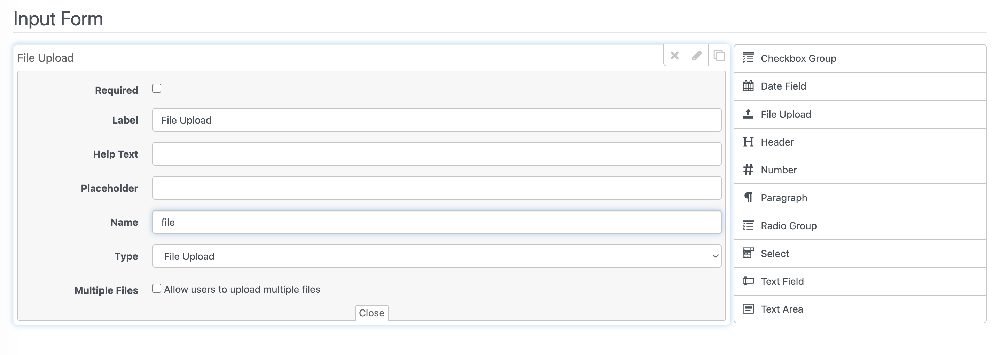
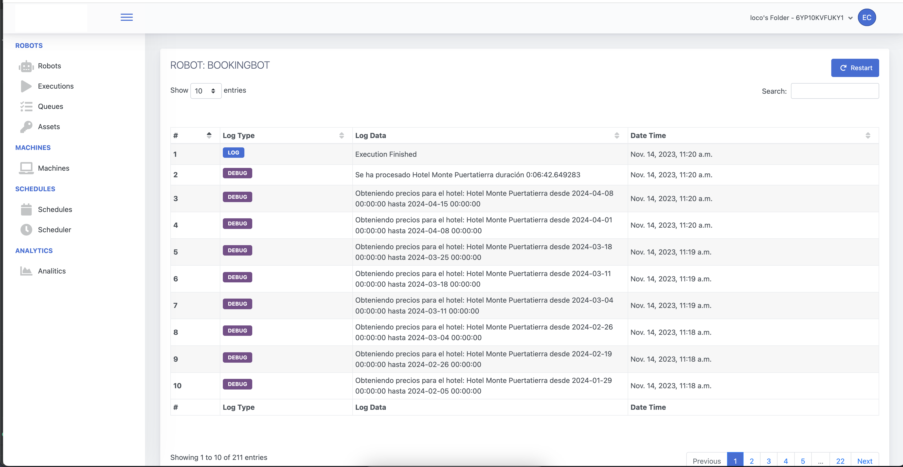
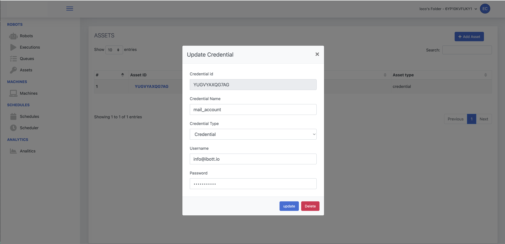
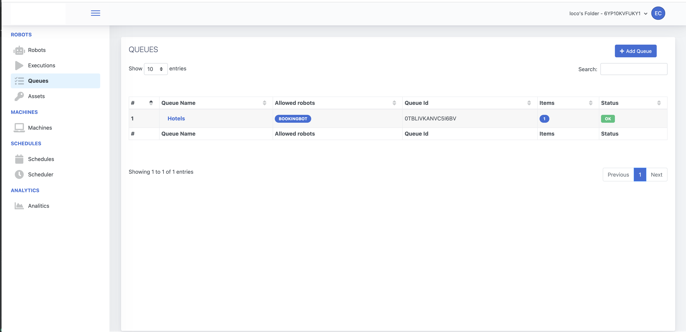
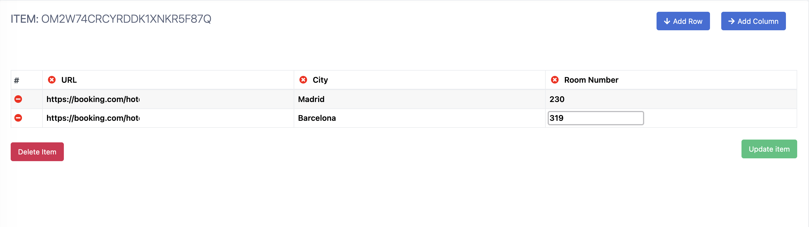
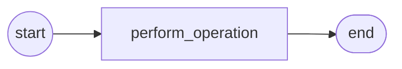
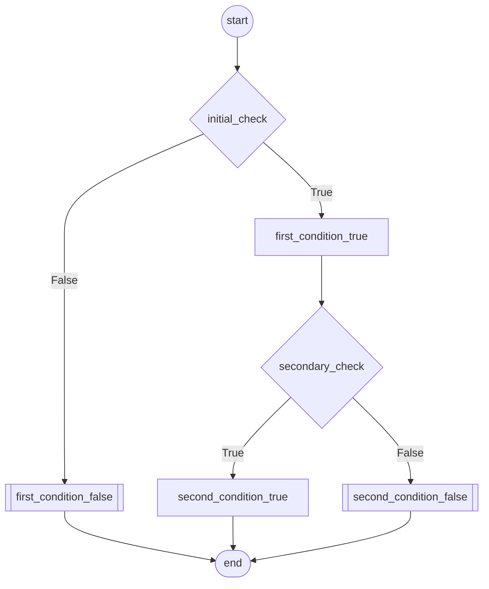
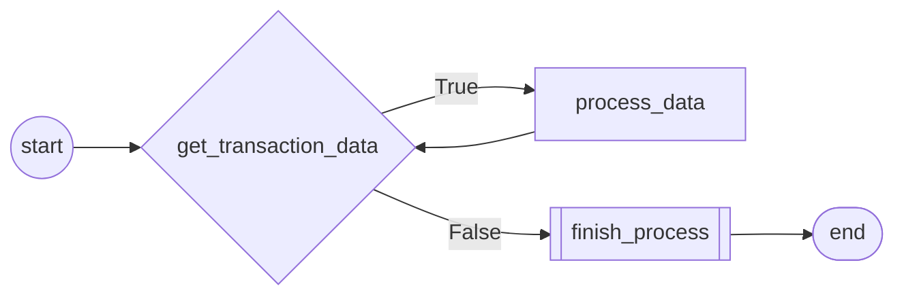

<p align="center">
  
</p>

# Robot Framework Wiki

Welcome to the Robot Framework Wiki. Here, you'll find detailed information to help you understand and utilize the advanced features of our automation framework. This document will guide you through the key components and show you how to implement and customize them for your specific needs.


## Dependencies

The Robot Framework is dependent on the `ibott-robot-manager` package, which is essential for managing the automated tasks within the framework. To ensure the framework runs smoothly, you will need to install this package.

### ibott-robot-manager Installation

The `ibott-robot-manager` can be installed directly from PyPI using pip. This package is required for the Robot Framework to communicate with the robot manager console and utilize its features. To install the package, run the following command in your terminal or command prompt:

```shell
pip install ibott-robot-manager
```

This command will download and install the ibott-robot-manager along with its dependencies.

Alternatively, if you are setting up your environment based on specific requirements outlined in a requirements.txt file from the robot-manager repository, you may install the dependencies as follows:

```shell
pip install -r requirements.txt
```


## Create your first robot
Within the **robot** directory, you'll find all the necessary files that define the Robot Framework's structure and behavior.
Bot Class in Robot Framework
The Bot class is a fundamental part of the Robot Framework, designed to serve as a base class for creating various types of robotic functionalities. 
Below is a detailed explanation of how to use the Bot class, along with a specific example.

### Overview of Bot Class
The Bot class typically encapsulates common functionalities and properties that are essential for different types of robots. 
It serves as a superclass from which specific robot classes can inherit.


### Using the Bot Class
To utilize the Bot class, one needs to inherit from it while creating a new robot class. 
This approach allows the new class to leverage the pre-defined functionalities of the Bot class, while also adding specific functionalities 
unique to the new robot.


```python
from robot.robot import Bot

class Robot(Bot):
    def __init__(self, **kwargs):
        super().__init__(**kwargs)

    def start(self):
        print("I'm the first method")

    def process(self):
        print("I'm the second method")

    def end(self):
        print("I'm the last method")
```
### Arguments:

The Robot class is designed to establish a connection with the robot manager console and accepts a variety of arguments for this purpose:

1. robotId (string): This is the unique identifier of the robot. It uniquely distinguishes one robot from another within the system.
2. executionId (string): This represents the specific execution session ID. It is used to track and manage individual execution sessions of the robot.
3. url (string): This is the endpoint URL used to connect with the robot manager console. It serves as the communication link between the Robot class and the console.
4. token (string): This token corresponds to the project's folder. It is used for authentication and authorization purposes, ensuring secure access to the console.
5. orchestrator_parameters (dictionary): These are additional parameters received from the robot manager console. They can be used to customize or configure the robot's operations according to specific needs.

These arguments can be received automatically from the robot manager console during a typical operation. Alternatively, 
for debugging or development purposes, they can be set manually in the debug.json file.

## Bot Attributes and Methods:
### 1. Robot Parameters: 
This attribute is a dictionary containing parameters sent from the orchestrator. When a bot is executed, 
it can receive various parameters from the robot console to be consumed during its operation. These parameters can include:

1. Strings: Textual data.
2. Booleans: True/False values. 
3. Dates: Date values. 
4. Files: File objects or paths. 
These parameters allow for dynamic and flexible bot operation, tailored to the specific needs of each task.

#### Handling Robot Parameters
File Parameters in Base64 Format: When files are sent from the robot console, they are encoded in Base64 format. 
This encoding ensures that file data is transmitted over networks in a text format, 
which is compatible with various system environments and network protocols.

#### Conversion of Base64 Strings to Files: 
The Bot class includes a specialized function, **save_file_from_console(string, folder=None)**, 
which efficiently handles the conversion of Base64 strings back into files. 
This function is crucial for processing file inputs received from the robot console.

#### Function Parameters:
1. **string**: The Base64 encoded string representing the file's content.
2. **folder (optional)**: The destination folder where the file will be saved. If not specified, a default location is used.
3. **Return Value**: This function returns the full path to the saved file, allowing the bot to access and utilize the file in its operations.

### Configure Parameters in Robot console 

#### Creating a New Form: 
During the robot setup, you need to create a new form in the robot console. 
This form serves as the interface for inputting the parameters that the robot will receive and utilize during its operations.

#### Example Form
<p align="center">
  
</p>

#### Defining Custom Field Names: 
In this form, each parameter requires a unique custom field name. 
These field names are not just identifiers but also serve as keys for the robot to retrieve and process the corresponding data. 
It's crucial to choose descriptive and relevant field names to ensure clarity and ease of use.

#### Parameter Retrieval in Robot: 
Once the form is configured and the robot is running, it will access the inputted parameters using these custom field names. 
The robot's code is designed to look for these specific field names to fetch and use the data accordingly.

##### Code Example
```python
from robot_manager.base import Bot

class Robot(Bot):
     def __init__(self, **kwargs):
        super().__init__(**kwargs, disabled=False)
        self.file = self.parameters.get('file')
        self.filepath = self.save_file_from_console(self.file)
````
#### Code Explanation
In the provided example:

Robot is a new class that inherits from Bot.
The __init__ method initializes the Robot class, with the super() function calling the initializer of the Bot class.
This ensures that any initialization in the Bot class is also applied to Robot.
Methods start, process, and end are defined as custom behaviors of the Robot class.


### 2. Logs
This attribute is an instance of the Log class, which is used to send logs to the console. 
The Log class plays a crucial role in monitoring and debugging the bot's activities by providing different levels of logging.

#### Log page Example: 
<p align="center">
  
</p>

### Log Class
The Log class is an integral part of the Bot superclass, enabling efficient logging of the bot's activities and exceptions.
#### 1. debug(log: str): 
This method sends a debug log to the robot manager console. It is used for detailed diagnostic information, 
typically of interest only when diagnosing problems. 
#### 2. trace(log: str): 
This method sends a trace log, which is used for general tracing of the application flow.
#### 3. log(log: str): 
This method sends an info log to the console. It is used for general informational messages that highlight the progress of the 
application at coarse-grained level.
#### 4. system_exception(error: str): 
This method is used to log system-level exceptions, indicating issues in the system's functioning, 
such as connectivity or hardware failures.
#### 5. business_exception(error: str): 
This method logs business-level exceptions, which are related to the logic and rules of the business process being 
automated.

#### Code Example:
```python
from robot_manager.base import Bot

class Robot(Bot):
     def __init__(self, **kwargs):
        super().__init__(**kwargs, disabled=False)
        self.log.trace("EXAMPLE LOG")
````

If there is an issue with the connection to the orchestrator, it raises an **OrchestratorConnectionError**, ensuring that any connectivity problems are promptly 
identified and can be addressed.

### 3. Assets
An Asset in Robotic Process Automation (RPA) is a critical component that represents a configurable piece of information which can be used across various 
automation tasks. These assets are managed and retrieved from the robot console to be used by your automated process.

#### Set Asset in robot Console
1. Navigate to the Assets Section
2. Input a unique name for the asset
3. Choose the appropriate type for the asset from the available options
4. Depending on the selected asset type, enter the necessary data or credentials


<p align="center">
  
</p>


#### Methods for Retrieving Assets
The robot console provides two methods to facilitate the retrieval of assets, ensuring flexibility and ease of use.

#### 1. get_asset_by_name(asset_name: str)
Retrieves an asset based on its name.
**Parameters**: asset_name (str): The name of the asset to be retrieved.
**Returns**: An instance of the Asset object.

#### 2. get_asset_by_id(asset_id: str)
Retrieves an asset using its unique identifier.
**Parameters**: asset_id (str): The unique identifier of the asset.
**Returns**: An instance of the Asset object.

### Asset Object
Once an asset is retrieved using either of the above methods, it is represented as an Asset object with the following attributes:

1. **type:** Indicates the type of the asset. It is initially set to None and should be defined based on the asset's nature.
2. **data:** Stores the asset's data. This attribute is used when the asset's type is not **'credential'**.
3. **username:** Represents the username part of a credential-type asset. This is applicable only when the asset's type is 'credential'.
4. **password:** Holds the password for a credential-type asset. Relevant only when the asset's type is 'credential'.

#### Example code
```python
from robot_manager.base import Bot

class Robot(Bot):
     def __init__(self, **kwargs):
        super().__init__(**kwargs, disabled=False)
        self.login_credentials = self.get_asset_by_name("PLATFORM_LOGIN")
        self.username = self.login_credentials.username
        self.password = self.login_credentials.password
```

### 3. Queues & Items
Bot class includes three predefined methods to work with queues.
Each of these methods interacts with the Queue Object, offering different functionalities for queue management. 
Here's a detailed explanation of these methods, including example code to demonstrate their usage.

#### 1. find_queue_by_id(queue_id: str)
Searches for and retrieves a queue using its unique identifier. **Returns:** Queue Object representing the queue with the specified ID.
**Parameters:** queue_id (str): The unique identifier of the queue.

##### Code Example:
```python
from robot_manager.base import Bot
from robot_manager.queues import Queue
class Robot(Bot):
     def __init__(self, **kwargs):
        super().__init__(**kwargs, disabled=False)
        queue_id = "12345"
        queue = self.find_queue_by_id(queue_id)
        print(queue.queue_name)  # Displays the retrieved Queue Object
```

#### 2. find_queues_by_name(queue_name: str)
Retrieves one or more queues that match a given name. **Returns:** A list of Queue Objects representing the queue(s) with the specified name.
**Parameters:** queue_name (str): The name of the queue.

##### Code Example:
```python
from robot_manager.base import Bot
from robot_manager.queues import Queue
class Robot(Bot):
     def __init__(self, **kwargs):
        super().__init__(**kwargs, disabled=False)
        queue_name = "ExampleQueue"
        queues = self.find_queues_by_name(queue_name)
        print(queues[0].queue_name)  # Displays the retrieved Queue Object
```

#### 3. create_queue(queue_name: str)
Creates a new queue with the specified name. **Returns:** Queue Object representing the newly created queue.
**Parameters:** queue_name (str): The name for the new queue.

##### Code Example:
```python
from robot_manager.base import Bot
from robot_manager.queues import Queue
class Robot(Bot):
     def __init__(self, **kwargs):
        super().__init__(**kwargs, disabled=False)
        queue_name = "ExampleQueue"
        new_queue = self.create_queue(queue_name)
        print(new_queue.queue_name)
```

### Queue Object 
The Queue object is central to managing queues in the robot manager console, allowing for the creation, update, and retrieval of queues from 
Orchestrator. You can also create and modify queues directly within the robot console by accessing the dedicated 'Queues' section. 
This feature allows for intuitive and streamlined management of your queue configurations, enhancing your workflow efficiency.

<p align="center">
  
</p>

#### Queue Object Attributes
1. **queue_name**: The name of the queue. 
2. **queue_id**: A unique identifier for the queue.
3. **robot_id**: The identifier of the robot associated with the queue.

#### Queue Object Methods
##### Methods for Retrieving Assets
The robot console provides two methods to facilitate the retrieval of Queues, ensuring flexibility and ease of use.

#### 1. create_item(item_data: dict): 
Creates a new item in the queue. **Returns:** Item Object.**Parameters:** item_data (dictionary): data associated with the item to be created.
```python
from robot_manager.base import Bot
from robot_manager.queues import Queue
class Robot(Bot):
     def __init__(self, **kwargs):
        super().__init__(**kwargs, disabled=False)
        queue_id = "12345"
        queue = self.find_queue_by_id(queue_id)
        item_data = {"year", "2023"}
        queue.create_item(item_data)
```

#### 2. get_next_item():
Retrieves the next pending item from the queue. **Returns**: Item Object.

```python
from robot_manager.base import Bot
from robot_manager.queues import Queue
class Robot(Bot):
     def __init__(self, **kwargs):
        super().__init__(**kwargs, disabled=False)
        queue_id = "12345"
        queue = self.find_queue_by_id(queue_id)
        item = queue.get_next_item()
        print(item.item_data)
```

#### 3. set_retry_times(times: int):
Sets the number of retry attempts for the items in the queue.**Parameters**: times: The number of retry attempts.
```python
from robot_manager.base import Bot
from robot_manager.queues import Queue
class Robot(Bot):
     def __init__(self, **kwargs):
        super().__init__(**kwargs, disabled=False)
        queue_id = "12345"
        queue = self.find_queue_by_id(queue_id)
        queue.set_retry_times(3)
```

### Item Object 
The Item Object is a fundamental component within the robot manager console, specifically designed for managing individual items within queues.
You can also create and modify queues directly within the robot console by accessing the dedicated 'Item' section. 
This feature allows for intuitive and streamlined management of your item data.
In the Robot's code, this object encapsulates various attributes and methods that allow for detailed tracking and manipulation of items, 
which are the individual units of work or tasks processed by the automated system.

<p align="center">
  
</p>


#### Item Object Attributes
1. **start_date**: The start date for retrieving items.
2. **end_date**: The end date for retrieving items.
3. **item_id**: A unique identifier for the item.
4. **item_data**: Data associated with the item.
5. **item_executions**: The number of times the item has been executed.
6. **value**: The value of the item.
7. **status**: The current status of the item (e.g., working, failed, pending).

#### Item Object Methods
1. **set_item_as_working()**: Marks the item as currently being processed. 
2. **set_item_as_ok()**: Marks the item as successfully processed.
3. **set_item_as_fail()**: Marks the item as failed in processing. 
4. **set_item_as_pending()**: Resets the item status to pending, indicating it is not yet processed. 
5. **set_item_executions()**: Increments the execution counter for the item, tracking how many times it has been processed.

```python
from robot_manager.base import Bot
from robot_manager.queues import Queue
class Robot(Bot):
     def __init__(self, **kwargs):
        super().__init__(**kwargs, disabled=False)
        queue_id = "12345"
        queue = self.find_queue_by_id(queue_id)
        
        item = queue.get_next_item()
        item.set_item_as_working()
        # TODO: Process The item
        item.set_item_as_ok()
```

### Design your flow using the @RobotFlow Decorator
To optimize the functionality and maintainability of robots in the Robot Framework, it is highly recommended to use the @RobotFlow decorator. 
This decorator plays a crucial role in defining and managing the flow of the robot.
Here are some best practices for its usage:

1. **Clear Flow Definition**: Use @RobotFlow to clearly define the sequence and logic of operations within your robot class and Enhances readability, makes the code easier to understand, and facilitates debugging and maintenance.
2. **Consistent Application**: Apply the @RobotFlow decorator to all methods that are part of the robot's operational flow. This ensures a consistent approach to defining the robot's behavior and interactions.
3. **Documenting Flow**: Alongside the decorator, document what each flow does. This helps other developers understand the purpose and functionality of each part of the flow. Clear documentation assists in future modifications and enhancements of the robot's code.
4. **Avoiding Complexity**: Strive to keep the flows simple and straightforward. Overly complex flows can lead to maintenance challenges. Break down complex tasks into smaller, manageable flows for better organization and readability.
5. **Testing Flow Logic**: Regularly test the flow logic to ensure that it behaves as expected. This practice helps in identifying and fixing bugs early in the development cycle.


## RobotFlow  Overview
RobotFlow is a Python class designed to facilitate the creation and management of a workflow in a process automation setting.
It's used as a decorator for methods within a robot class, enabling the definition of a sequence of operations or tasks.

### Key Features and Usage
**Defining Workflow Nodes**:
RobotFlow allows methods to be defined as nodes in a workflow. Each decorated method corresponds to a specific task or step in the process.
The node argument in the decorator specifies the type of node to be used for executing the method. 
This could relate to different stages or actions in the workflow, like starting, processing, decision-making, etc.

### Method Tracking and Positioning
**Default Execution Order**: An internal counter within the RobotFlow class is used to auto-increment and track the position of each method in the 
workflow. This feature ensures a structured and ordered flow of the nodes. In the absence of explicitly defined parent nodes (parents parameter), 
RobotFlow defaults to executing methods in the order in which they are defined in the class. This sequential execution is based on the position 
assigned to each method by the internal counter. This behavior is crucial for workflows where the execution sequence is linear and does not require 
complex branching or conditional logic.

## Code Example
```python
from robot_manager.base import Bot
from robot_manager.flow import RobotFlow
from .flow import Nodes

class Robot(Bot):
    """
    Robot Class
    ----------------
    The Robot class extends the Bot class, providing a framework for creating automated workflows.
    It uses the RobotFlow decorator to define a sequence of actions, each represented as a method.
    The class demonstrates handling of various inputs and integration with an orchestrator.
    """

    def __init__(self, **kwargs):
        # Initialize the base class (Bot)
        super().__init__(**kwargs)

    @RobotFlow(node=Nodes.StartNode)
    def start(self, *args):
        """
        Initializes the workflow. As the entry point, it's marked with StartNode.
        Accepts *args for flexible data handling.
        """
        print("Workflow started with args:", args)

    @RobotFlow(node=Nodes.OperationNode)
    def perform_operation(self, *args):
        """
        Executes a core operation of the workflow. Marked with OperationNode.
        The method can process variable inputs via *args.
        """
        print("Performing operation with args:", args)

    @RobotFlow(node=Nodes.EndNode)
    def end(self, *args):
        """
        Concludes the workflow, marked as the EndNode.
        Can take additional inputs through *args.
        """
        print("Workflow ended ")

```

## Code explaination

In the RobotFlow system, each method decorated with the @RobotFlow decorator represents a node in the workflow. These nodes are interconnected and define the sequence and logic 
of the workflow. 
Here's how they relate to each other in the previous example:

### StartNode (start method)**:
This is the entry point of the workflow.
In our example, the start method is marked as a StartNode, indicating that it's the first node to be executed when the workflow begins.

### OperationNode (perform_operation method):
After the StartNode, the workflow moves to the **OperationNode**.
In the example, perform_operation is an **OperationNode**, which represents the main action or task in the process. This is where the core functionality of the workflow is executed.
The sequence moves from the **StartNode** to the **OperationNode** automatically, reflecting a linear flow.

### EndNode (end method):

The workflow concludes with the **EndNode**.
The end method in our example is marked as an **EndNode**, signifying the end of the process.
Once the OperationNode completes its task, the flow transitions to the **EndNode**, marking the completion of the workflow.


## Flow Representation
When working with complex workflows, especially in automation and process management, it's often helpful to have a visual 
representation of the flow. This aids in understanding the sequence of operations, the relationships between different steps, 
and the overall structure of the process. Mermaid is a tool that enables the creation of such visual representations using simple, text-based descriptions.
Below is a Mermaid flowchart representation of the simple workflow defined in the Robot class:



### Generating Documentation with Shell Command
To generate documentation for your workflow, including details about the methods and their relationships, you can use a command-line utility provided with your system.
If such functionality is implemented, you might run a command like the following in your shell:

```shell
python manage.py --doc
```


## More Flow Examples

### Nested Conditional Workflow Example

````python
from robot_manager.base import Bot
from robot_manager.flow import RobotFlow
from .flow import Nodes

class Robot(Bot):
    def __init__(self, **kwargs):
        # Initialize the base class (Bot)
        super().__init__(**kwargs)

    @RobotFlow(node=Nodes.StartNode)
    def start(self, *args):
        print("Starting nested conditional workflow")

    @RobotFlow(node=Nodes.ConditionNode, parents=["start"], condition=lambda x: x < 5)
    def initial_check(self, *args):
        # The lambda function evaluates and returns a boolean value
        condition = random.randint(0, 5)
        print(f"First check evaluation for {condition}")
        return condition

    @RobotFlow(node=Nodes.OnTrue, parents=["initial_check"])
    def first_condition_true(self, *args):
        print("Initial condition met, proceeding with first true branch")

    @RobotFlow(node=Nodes.OnFalse, parents=["initial_check"])
    def first_condition_false(self, *args):
        print("Initial Not met, proceeding with first true branch")

    @RobotFlow(node=Nodes.ConditionNode, parents=["first_condition_true"], condition=lambda x: x > 5)
    def secondary_check(self, *args):
        # Secondary condition check with a lambda function that returns a boolean value
        condition = random.randint(0, 10)
        print(f"Second check evaluation for {condition}")
        return condition

    @RobotFlow(node=Nodes.OnTrue, parents=["secondary_check"])
    def second_condition_true(self, *args):
        print("Secondary condition met, executing specific task")

    @RobotFlow(node=Nodes.OnFalse, parents=["secondary_check"])
    def second_condition_false(self, *args):
        print("Secondary condition not met, executing alternative task")

    @RobotFlow(node=Nodes.EndNode, parents=["first_condition_false", "second_condition_false", "second_condition_true"])
    def end(self, *args):
        print("Ending nested conditional workflow")

````
#### Flow Explaination
1. StartNode (**start method**): Serves as the entry point of the workflow.
2. ConditionNode (**initial_check method**): Evaluates a condition using a lambda function. The flow diverges based on the condition's outcome, either continuing to **first_condition_true** if true, or **first_condition_false** if false.
3. OnTrue and OnFalse Nodes (**first_condition_true** and **first_condition_false** methods): Handle the outcomes of the initial_check. **first_condition_true** leads to another condition check (secondary_check), whereas **first_condition_false** directs the flow towards the end.
4. Nested ConditionNode (**secondary_check method**): A second level of conditional logic, branching to either **second_condition_true** or **second_condition_false.**
5. EndNode (**end method**):Concludes the workflow. This node is reached from various points, demonstrating multiple paths converging to a single end point.

#### Flow Representation


### Transactional Workflow Example
A Transactional Workflow in Robotic Process Automation (RPA) is designed to handle a series of tasks or operations that are dependent on 
transactional data inputs. This type of workflow is particularly relevant in scenarios where data is processed in discrete units or transactions, 
such as in financial operations, order processing, customer service interactions, and more.
````python
from robot_manager.flow import RobotFlow
from .flow import Nodes, Conditions
from robot_manager.base import Bot

class Robot(Bot):
    def __init__(self, **kwargs):
        super().__init__(**kwargs, disabled=False)

    @RobotFlow(node=Nodes.StartNode)
    def init(self, *args):
        # Transaction data example
        self.data = [1, 2, 3, 4, 5]
        self.log.trace("start")

    @RobotFlow(node=Nodes.ConditionNode, parents=["init", "process_transaction"],condition=lambda data: True if len(data) > 0 else False)
    def get_transaction_data(self, *args):
        # Simulation of data fetching process
        self.log.trace("get_transaction_data")
        return self.data

    @RobotFlow(node=Nodes.OnTrue, parents=["get_transaction_data"])
    def process_transaction(self, *args):
        # Get first available item of array
        item = args[0][0]

        # TODO: Create process

        # Remove Processed Item
        self.data.pop(0)
        self.log.trace(f"process_transaction_data for element {item}")

    @RobotFlow(node=Nodes.OnFalse, parents=["get_transaction_data"])
    def finish_process(self, *args):
        self.log.trace(f"finish_process")

    @RobotFlow(node=Nodes.EndNode, parents=["finish_process"])
    def end(self, *args):
        print("end")
````
#### Flow Explaination
**Loop Structure**: The **get_transaction_data** method is repeatedly called after Init and after each **process_transaction** execution.
It forms a loop that continues as long as there is data to process.

**Condition Evaluation**: The lambda function in **get_transaction_data** checks if the returned data is bigger than 0,
determining whether to process more transactions or end the workflow.

#### Flow Representation


To gain a clearer insight into the functioning of the conditional node, let's delve into a comprehensive explanation of this node as utilized
in the aforementioned example:

````python
@RobotFlow(node=Nodes.ConditionNode, parents=["init","process_transaction"], condition=lambda data: True if len(data) > 0 else False)
````

In the outlined code, the get_transaction_data method functions as a crucial conditional node within the workflow. 
It is uniquely connected to two parent nodes: init and process_transaction. 
This setup allows the method to be invoked either after the **init method** or following the completion of the **process_transaction** method.

### Structure of the Conditional Node

#### Child Nodes:
The get_transaction_data node is designed to branch into two distinct paths, determined by its child nodes OnTrue and OnFalse.
These paths are defined as follows:
```python
@RobotFlow(node=Nodes.OnTrue, parents=["get_transaction_data"]) 
```
For scenarios where the condition evaluates to True.
```python  
@RobotFlow(node=Nodes.OnFalse, parents=["get_transaction_data"])
```
For scenarios where the condition evaluates to False.

### Condition Function:
The direction of the workflow after get_transaction_data is determined by the specified condition function: **lambda data: True if len(data) > 0 else False**
This lambda function assesses whether the data returned by **get_transaction_data** is bigger than 0 or not. Based on this evaluation:
If the function returns True (i.e., data is not empty), the workflow follows the **OnTrue** path, indicating more data is available for processing.
If the function returns False, the workflow proceeds along the **OnFalse** path, signaling the absence of further data to process.


### Creating Custom Node Classes
#### Inherit from RobotNode:
Create a new class for your custom node, ensuring it inherits from the RobotNode class. 
This inheritance is crucial as RobotNode is the base class for all robot nodes.
#### Implement or Override Methods:
Implement or override necessary methods, particularly the run method if you need custom behavior. 
The default implementation of run calls the method associated with the node and passes any data to the next node in the workflow.

#### Register the Custom Node:
To make your custom node available for use, register it in the Nodes enum. 
This registration links your custom class to an identifiable node type in the workflow.

#### Example of a Custom Node

```python
from enum import Enum
from robot_manager.nodes import *
class CustomLoggingNode(RobotNode):
    def run(self, robot, *args, **kwargs):
        # Custom implementation for logging
        print("Custom logging node is running")
        super().run(robot, *args, **kwargs)

class Nodes(Enum):
    # ... existing nodes ...
    LoggingNode = CustomLoggingNode
```

### Using Custom Conditions
The Conditions enum allows you to define lambda functions for use as conditions in conditional nodes (ConditionNode). To add a new condition:

#### Define a Lambda Function:
Write a lambda function that returns a boolean value based on your specific condition.

#### Add to Conditions Enum:
Register this lambda function in the Conditions enum.

```python
class Conditions(Enum):
    # ... existing conditions ...
    is_even = lambda x: x % 2 == 0
    
```
### Using Custom Nodes and Conditions in Your Workflow
#### Custom Node Usage:
```python
@RobotFlow(node=Nodes.LoggingNode)
def custom_logging_method(self, *args):
    # Your implementation
```

#### Custom Condition Usage:

```python
@RobotFlow(node=Nodes.ConditionNode, condition=Conditions.is_even)
def check_if_even(self, *args):
    # Your implementation
```

### Exception Management

The module, **exceptions.py**, provides custom exception classes for handling various types of errors that may occur during the execution 
of a robotic process. These exceptions are specialized extensions of the RobotException class and are used to differentiate between 
business logic errors and system-related errors.

#### BusinessException
**Inheritance**: Inherits from RobotException.
**Purpose**: BusinessException is raised in scenarios related to business logic failures. 
This includes situations such as input errors, data validation failures, or any other exception that is a direct result of business rule violations.
**Process Exception Method**:This class overrides the process_exception method from RobotException. 
The overridden method logs the business exception and then directs the robot's flow to a specified next action.
**Actions**: The robot can handle this exception with various actions such as retry, restart, skip, or go to a specific node, 
depending on the implementation in the process exception method.

### SystemException
**Inheritance**: Inherits from RobotException.
**Purpose**: SystemException is tailored to handle errors related to system operations, such as connection issues, external service failures, 
or any hardware or software malfunctions.
**Process Exception Method**:This class overrides the process_exception method from RobotException. 
The overridden method logs the business exception and then directs the robot's flow to a specified next action.
**Actions**: The robot can handle this exception with various actions such as retry, restart, skip, or go to a specific node, 
depending on the implementation in the process exception method.

### Exception methods
#### 1. retry(max_retry_times)
**Functionality**: This action attempts to rerun the current node where the exception occurred.
**Usage**: It is useful in scenarios where a transient error might have caused the exception, and a simple retry could resolve the issue.
**Limitations**: The method includes a mechanism to limit the number of retries (max_retry_times) to prevent infinite loops.

#### 2. restart(max_retry_times)
**Functionality**: This action restarts the entire process from the first node in the flow.
**Usage**: Particularly beneficial in cases where the process needs a complete reset due to a fundamental issue that affects the current state.
**Limitations**: Similar to retry, it also respects a maximum number of retry attempts (max_retry_times) to avoid infinite restart loops.

#### 3. go_to_node(next_node, max_retry_times)
**Functionality**: Directs the flow to a specific node, as defined by the next_node argument.
**Usage**: Enables dynamic redirection of the process flow, allowing for custom responses to specific exceptions.
**Additional Context**: It takes into account the number of retries to this node and applies the same retry limit logic.


#### 4. skip()
**Functionality**: Skips the current node and proceeds to the next one in the workflow.
**Usage**: Ideal for bypassing a node that isn't critical to the process or can be safely ignored under certain error conditions.

#### 5. stop()
**Functionality**: Halts the entire process immediately.
**Usage**: Used in situations where continuing the process is deemed unnecessary or could lead to adverse outcomes.

### General Notes
**Implementation**: All these actions are defined as methods in the RobotException class and are intricately linked to the workflow defined in RobotFlow.
**Customization**: These methods provide a versatile toolkit for handling exceptions in various ways, catering to the diverse needs and complexities of different automation tasks.
**Exception Handling**: Careful use of these actions in exception handling allows for more resilient, flexible, and maintainable robotic processes

#### Example of a Process Exception Method:
```python
from robot_manager.exceptions import RobotException
class SystemException(RobotException):
    
    def _init__(self, *args, **kwargs):
        super.__init__(*args, **kwargs)
    def process_exception(self):
       #send log to robot manager console.
       self.robot.Log.business_exception(self.message)
       #Process exception
       if self.next_action == "retry":
          self.retry(max_retry_times=3)
       elif self.next_action == "restart":
          self.restart(max_retry_times=3)
       elif self.next_action == "go_to_node":
          self.go_to_node(next_node ="end", max_retry_times=3)
       elif self.next_action == "skip":
          self.skip()
       elif self.next_action == "stop":
          self.stop()
       else:
          raise Exception("Invalid next_action")
```

#### Arguments for Both Exceptions

1. **Robot**: An instance of the Robot class, allowing the exception to interact with the robot's workflow and logging mechanisms.
2. **Message**: A descriptive message detailing the exception.
3. **next_action**: Specifies the method from the Robot class to execute after the exception occurs. This could include actions like retry, restart, skip, or any custom-defined method for error handling.

#### Example of exception Raise

```python
from .exceptions import BusinessException
try:
    # Your code here
except:
    raise BusinessException(self, Message="Loggin fail", next_action= "retry"  )
```


 
